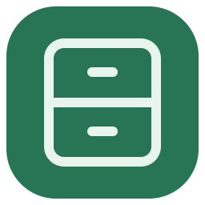
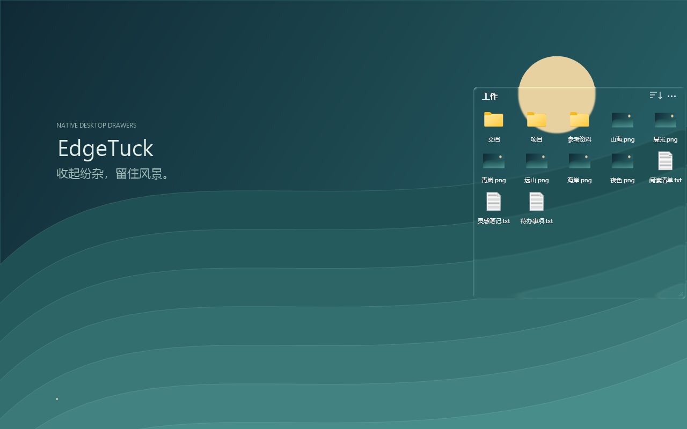
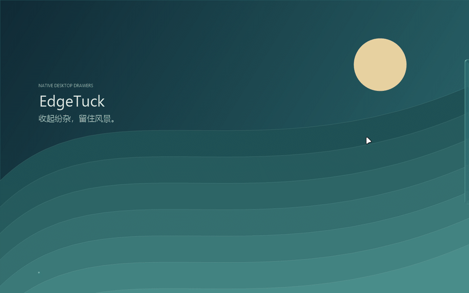
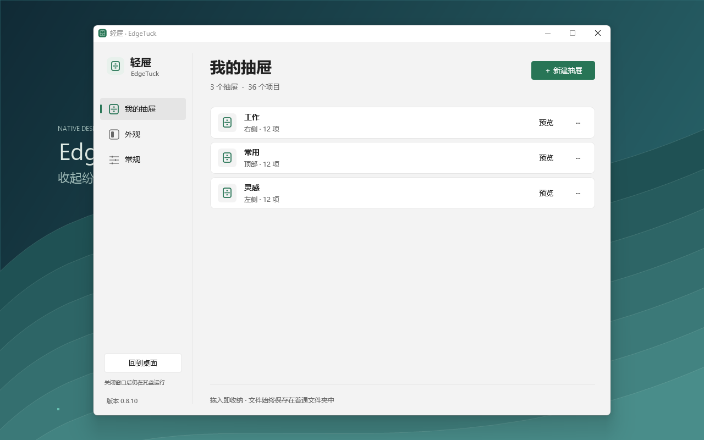
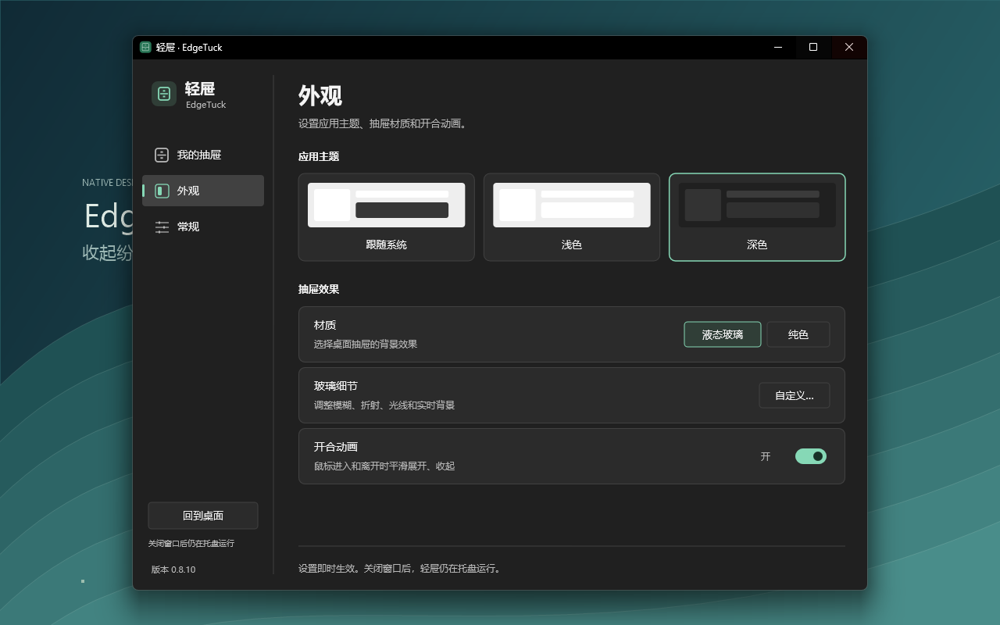

<p align="center">
  
</p>

<h1 align="center">EdgeTuck · 轻屉</h1>

<p align="center">收起纷杂，留住风景。</p>
<p align="center">Windows 桌面抽屉 · 液态玻璃 · 原生 C++</p>

把文件收进屏幕边缘，给桌面留一点空白。

轻屉将常用文件、文件夹和快捷方式收纳到桌面左侧、右侧或顶部的抽屉中。鼠标靠近时展开，离开后收回，平时只留下一条窄窄的玻璃边缘。

每个抽屉背后都是一个**普通文件夹**。整理好的文件可以直接在资源管理器中访问，即使以后不再使用轻屉，也能保留原来的分类。

> 当前版本：**0.8.11 · 开发预览**。面向 Windows 11 22H2 及以上版本的 x64 系统，目前围绕主显示器工作区布局。



<details>
<summary>查看开合演示与设置界面</summary>







</details>

以上为真实界面在隔离示例场景中的截图与录制；背景和示例文件由展示工具生成。动图经过缩放和调色板压缩，不作为帧率或延迟测量。生成方式见 [展示素材说明](docs/SHOWCASE.md)。

## 可以做什么

- **从边缘取用文件**：左、右、顶部均可放置抽屉；拖动调整位置和大小，沿桌面网格排列。
- **液态玻璃与纯色外观**：实时桌面背景、边缘折射与细微色散；支持浅色、深色、跟随系统，以及玻璃细节调整和动画开关。
- **拖入整理，拖出取回**：支持普通文件、文件夹和快捷方式，多选、复制、重命名，以及抽屉之间的转移。
- **熟悉的文件体验**：系统图标、图片缩略图、经典 Windows 文件右键菜单；也可以直接打开抽屉对应的文件夹。
- **按自己的习惯排序**：名称、大小、类型、修改时间、最近使用和手动排序，每个抽屉分别保存。
- **随时从资源管理器访问**：可在“此电脑”中添加轻屉文件夹入口，方便浏览和选择文件。
- **原生桌面应用**：C++20 实现，无内嵌浏览器、无常驻服务；提供托盘入口和可选的登录自启动。

### 玻璃，也可以很清透

玻璃材质将背景模糊、边缘折射和光照分开控制，可以保留桌面细节，也可以调成更柔和的效果。

在“外观 → 玻璃细节”中，可以选择清透、柔和、晶亮预设，或分别调整模糊、弯曲、亮度和色散。开启实时背景后，展开、收回和收起时露出的边缘使用同一套玻璃材质，跟随可捕获的桌面背景变化。

抽屉位于桌面层，普通应用窗口可以正常覆盖它。轻屉保留原生桌面的图标、网格和右键菜单，新建在桌面上的文件仍先留在桌面，由你决定何时整理。

## 开始使用

从 [Releases 页面](https://github.com/HavrenL/EdgeTuck/releases/tag/v0.8.11) 下载 `EdgeTuck-0.8.11-windows-x64.zip`，解压整个目录后双击 `EdgeTuck.exe` 打开设置，无需安装。

目前提供开发预览版，系统要求和已知限制见下文。也可以按[源码构建说明](#从源码构建)自行编译。

1. 在“我的抽屉”中点击“新建抽屉”，选择边缘并命名。
2. 把文件拖到抽屉上，完成收纳。
3. 关闭设置窗口，回到桌面；鼠标移到抽屉边缘即可展开。
4. 通过托盘图标重新打开设置。需要完全退出时，选择“退出轻屉”。

可以在“常规 → 存放位置与迁移”中选择收纳目录，在“外观”中切换主题、材质和动画。

### 常用操作

| 操作 | 行为 |
| --- | --- |
| 双击项目 | 使用系统默认程序打开 |
| 普通拖入 | 将文件移入抽屉文件夹 |
| 按住 `Ctrl` 拖入 | 复制文件，保留原件 |
| 拖到另一个抽屉 | 将文件移动到另一个分类文件夹 |
| 在同一抽屉内拖动 | 调整显示顺序，切回自定义排序 |
| 拖回桌面 / 按 `Delete` | 将已收纳的文件移回桌面 |
| `Ctrl` / `Shift` + 单击 | 多选 / 范围选择 |
| `Ctrl+C` / `Ctrl+V` | 复制 / 粘贴；从系统剪切后粘贴则执行移动 |
| `F2` / `F5` | 重命名 / 刷新 |
| `Ctrl+Shift+N` | 在当前抽屉中新建文件夹 |
| 右上角排序按钮 | 选择排序方式 |

**最近使用**只记录在抽屉中双击、且系统成功接受打开请求的项目。当前展开时保持原来的顺序，完全收回后再更新，下次展开时最近用过的项目排在前面。单击、悬停、回车和右键打开不计入。

> 抽屉里的 `Delete` 表示“移回桌面”；系统右键菜单中的“删除”则执行 Windows 的文件删除操作。

## 文件放在哪里

新用户默认使用独立目录 `%USERPROFILE%\EdgeTuck`，也可以选择其他目录或桌面模式。一个典型的分类结构如下：

```text
EdgeTuck/
├── ET_工作/
│   ├── 报告.docx
│   └── 参考资料/
├── ET_创作/
│   └── 草图.png
└── ET_常用/
    └── 编辑器.lnk
```

**收纳会改变实际文件路径。** 例如，桌面上的 `报告.docx` 拖入“工作”抽屉后，会移动到 `ET_工作` 文件夹中；它没有被打包进程序或存入专用数据库。

- 解散抽屉只移除展示，保留文件夹及内容，并支持撤销最近一次解散。
- 在轻屉中给抽屉改名，会同步修改绑定的文件夹名；资源管理器中的文件夹改名也会同步回来。
- 收纳目录与程序、配置分开。删除轻屉程序后，分类文件夹仍可独立使用。
- 遇到同名文件时保留两份，不自动覆盖；同名文件夹不自动合并。
- 改名或迁移会改变路径，其他软件中写死的旧路径需要相应调整。

### 为什么采用文件夹归档

轻屉最初的设想是：文件仍放在原来的桌面路径，收进抽屉后，只让对应图标从桌面视图中隐藏，同时保留原生桌面的网格、框选和文件操作。

但在现阶段对 Windows 11 的调研和测试中，我们尚未找到稳定、公开且适合接入原生桌面的逐项隐藏方式，也没有找到完整满足这些要求的现成开源方案。依赖 Explorer 内部实现的做法可能随系统更新失效，带来持续的兼容性适配与维护负担，因此暂未采用。

目前选择将文件整理进普通分类文件夹，再通过抽屉直观展示。这个取舍会改变文件路径，但分类结果可以独立于轻屉保留，后续查看、备份或停止使用软件都更直接。如果将来找到可靠的桌面视图隐藏方案，我们也会继续评估。

### 两种存放方式

| 模式 | 文件位置 | 桌面上的表现 |
| --- | --- | --- |
| 独立目录（新用户默认） | 用户目录或自选目录下的 `ET_名称` 文件夹 | 分类文件夹不占用桌面图标位置 |
| 桌面模式 | 桌面上的 `ET_名称` 文件夹 | 运行时将绑定文件夹图标放到屏幕外，正常退出时恢复 |

桌面模式保留系统网格与排列设置。开启“自动排列”时，分类文件夹保持可见。放到屏幕外的文件夹仍属于桌面视图，可能被桌面全选等操作选中；Explorer 重新排列图标时也可能短暂显示它们。

### 迁移已有抽屉

“存放位置与迁移”区分两种操作：**保存新抽屉的位置**只影响以后创建的抽屉；**一键迁移现有抽屉**才会搬动已有文件。

同一磁盘卷内直接移动整个文件夹；跨卷则复制、校验，再保存新绑定并回收旧文件夹。迁移支持进度显示和取消，并保存恢复记录。发生占用、校验失败或恢复冲突时会提示并保留相关文件，不强行覆盖。

跨卷迁移目前不支持含符号链接、目录联接、云端占位项目等部分特殊内容的文件夹。

## 当前边界

轻屉仍在开发，以下能力尚未完整覆盖：

- **显示器**：目前围绕主显示器布局，多显示器和混合缩放需要进一步适配。
- **系统菜单**：使用真正的经典 Windows Shell 菜单，尚未实现 Explorer 的完整 Windows 11 新式菜单。第三方扩展可能造成首次加载较慢；加载失败时提供基本菜单和重试入口。
- **系统图标**：“此电脑”“回收站”“控制面板”等虚拟 Shell 项目暂不支持拖入收纳。
- **实时玻璃**：背景捕获和 GPU 处理存在开销与延迟；不同动态壁纸宿主、远程桌面和显卡环境仍需兼容性验证。捕获不可用时可能使用降级背景，外观会有差异。
- **运行与发布**：目前是便携运行方式，可访问性、安装卸载体验及更广泛的系统兼容性仍需完善。

## 从源码构建

### 环境

- Windows，x64。
- Visual Studio 2022 或对应 Build Tools，安装“使用 C++ 的桌面开发”。
- Windows 11 SDK，包含 HLSL 编译器 `fxc.exe`。
- CMake 3.24 或更高版本，可在终端调用。

项目使用 MSVC 和 C++20。当前构建不需要额外下载第三方依赖，C++ 运行时静态链接。

在项目根目录的 PowerShell 中运行：

```powershell
# 构建、运行测试，并生成 dist 目录
.\build.ps1

# 完成上述步骤后，通过桌面 Explorer 会话启动应用
.\build.ps1 -Run
```

也可以分别运行：

```powershell
cmake -S . -B build -G "Visual Studio 17 2022" -A x64
cmake --build build --config Release --parallel
ctest --test-dir build -C Release --output-on-failure
```

`build.ps1` 会将可运行程序整理到 `dist\EdgeTuck.exe`。直接使用 CMake 时，程序位于 `build\Release\EdgeTuck.exe`，不会自动生成 `dist` 发布目录。

测试包括布局、排序、文件操作、目录迁移、菜单隔离、图标加载及原生窗口检查。窗口与 GPU 测试需要交互式 Windows 桌面；测试前请退出平时使用的轻屉，避免测试窗口与日常抽屉混在一起。

### 项目结构

```text
src/          应用、桌面集成、文件操作和玻璃渲染
resources/    图标、版本资源与应用清单
tests/        自动测试与手动诊断工具
docs/         当前设计说明、来源记录与公开展示素材
experiments/  独立材质实验
tools/        隔离展示工具与源码导出脚本
build.ps1     构建、测试与便携目录打包
CMakeLists.txt
```

界面使用 Win32、Direct2D / DirectWrite 和 Windows Composition；实时背景通过 Windows Graphics Capture 获取，在 GPU 上完成模糊与 HLSL 折射处理。文件拖放与操作通过 Windows Shell 接口完成，文件菜单扩展在独立辅助进程中加载。

`build/`、`dist/` 和 `artifacts/` 是本机构建或验证产物，已排除在版本控制之外。本机历史排查记录不随源码发布。开发流程见 [开发指南](docs/DEVELOPMENT.md)，组件划分见 [架构说明](docs/ARCHITECTURE.md)。

## 配置与问题反馈

| 内容 | 位置 |
| --- | --- |
| 默认收纳目录 | `%USERPROFILE%\EdgeTuck` |
| 设置与抽屉绑定 | `%LOCALAPPDATA%\EdgeTuck\settings.dat` |
| 运行日志 | `%LOCALAPPDATA%\EdgeTuck\logs\runtime.log` |
| 迁移恢复记录 | `%LOCALAPPDATA%\EdgeTuck\migrations` |

反馈问题时，请附上轻屉版本、Windows 版本、显示缩放、显示器数量、材质模式以及复现步骤。涉及文件操作时，说明文件类型和操作来源；分享日志前，请隐去个人路径等信息。

欢迎提交问题和改进建议。涉及文件移动、删除或迁移的修改，请使用临时测试文件验证，并说明失败与恢复行为。

## 参考与致谢

材质探索及桌面集成研究参考了多个开源项目。具体参考范围、当时的版本与随项目分发的资源来源见 [参考与资源说明](docs/REFERENCES.md)。研究参考不代表构建依赖。

## 许可证

本项目采用 [MIT 许可证](LICENSE)，Copyright (c) 2026 HavrenL。
